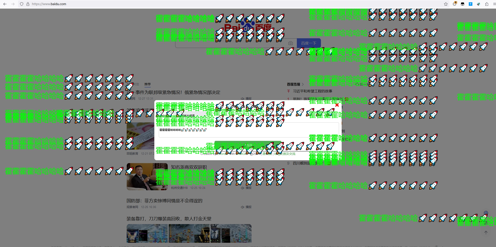
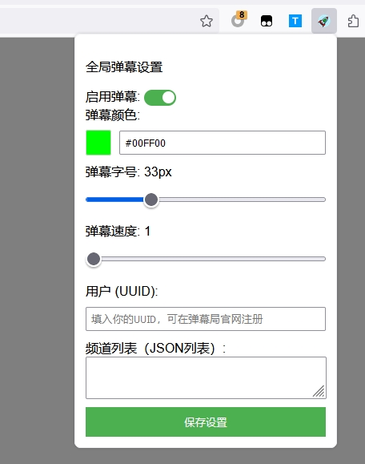
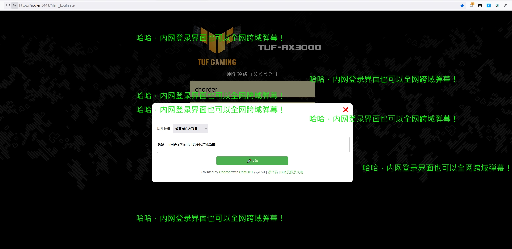
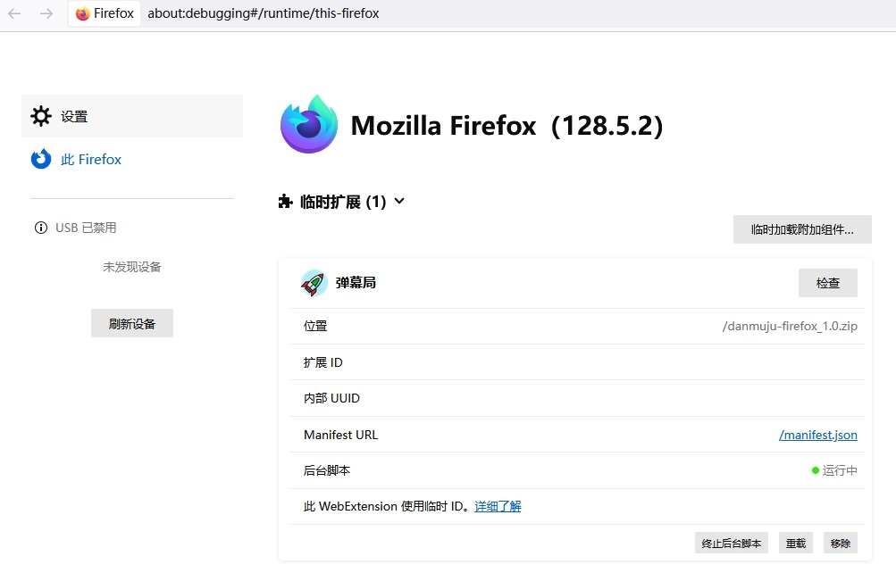
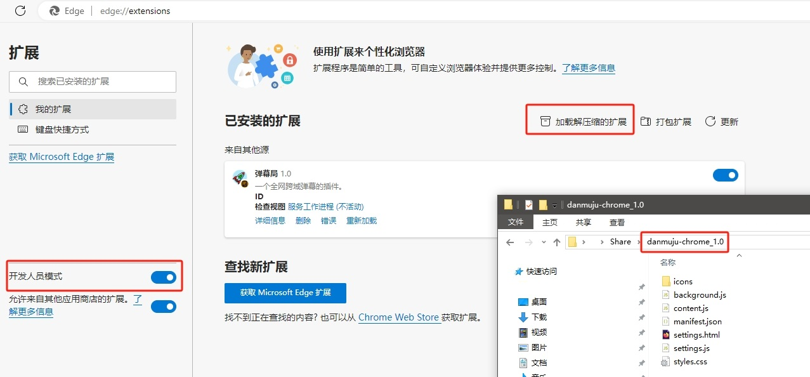

# 弹幕局

一个开源的全网弹幕浏览器插件，包含服务端（基于CloudFlare Pages）。

## 插件截图

在某度首页弹幕：

发送弹幕的面板：

弹幕设置界面：

内网弹幕：

## 安装插件客户端

首先下载插件源码，地址：

Chrome:https://github.com/Chorder/danmuju/tree/master/clients/danmuju-chrome
Firefox:https://github.com/Chorder/danmuju/tree/master/clients/danmuju-firefox

根据你需要的版本，将上面的插件源代码下载到本地后，

火狐，在拓展管理中，点击“临时加载附加组件”->选择文件夹中的manifest.json，即可载入。

Edge和Chrome，在拓展管理中，点击“加载解压缩的拓展”，即可载入。

## 自定义插件设置

如果你对插件的使用手感不满意，尤其是对于快捷键F4不是很满意，可以在插件源码content.js的第501行，修改成你想要的快捷键即可。

## 部署私有频道

待完善

## 其他

欢迎提交PR，一起不断丰富和完善这个插件！