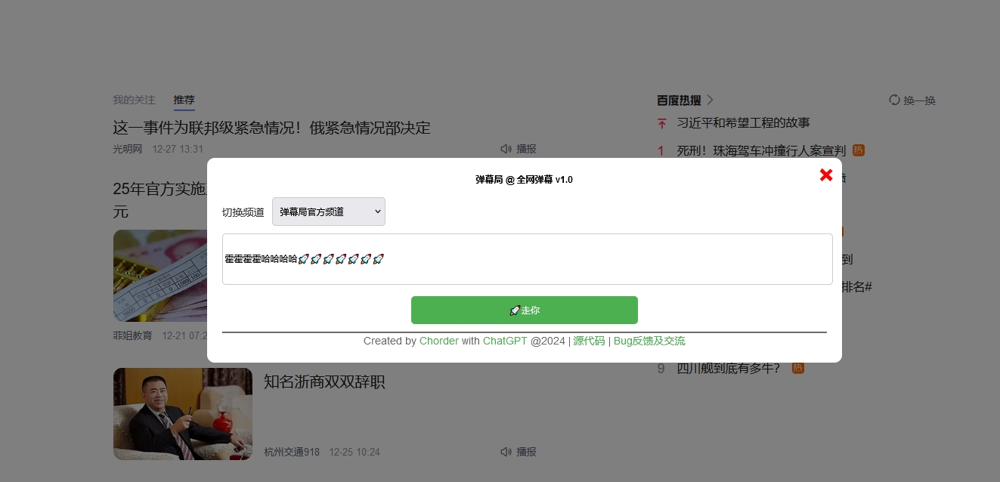

# 弹幕局

一个开源的全网弹幕浏览器插件，包含服务端（基于CloudFlare Pages）。

## 插件截图

在某度首页弹幕：


发送弹幕的面板：



弹幕设置界面：


内网弹幕：


## 如何使用

在安装好插件客户端之后，默认弹幕是**关闭**的，需要点开插件的设置界面，开启弹幕才能加载弹幕。

在要弹幕的网页上按下快捷键`F8`（快捷键可以在插件源码content.js的第501行，修改成你想要的快捷键），弹出弹幕发送框，输入弹幕即可发送。


## 安装插件客户端

首先下载插件源码，地址：

可以把整个项目下载下来，然后把项目根目录下的`clients/danmuju-chrome`文件夹拷贝到你希望的位置。

Chrome:https://github.com/Chorder/danmuju/tree/master/clients/danmuju-chrome
Firefox:https://github.com/Chorder/danmuju/tree/master/clients/danmuju-firefox

根据你需要的版本，将上面的插件源代码下载到本地后，

Edge和Chrome，在拓展管理中，点击“加载解压缩的拓展”->选择文件夹中的manifest.json，即可载入。


火狐，在拓展管理中，点击“临时加载附加组件”->选择文件夹中的manifest.json，即可载入。


## 部署私有频道

1. 克隆仓库、安装wrangler

首先克隆该仓库

`git clone https://github.com/Chorder/danmuju`

进入到仓库中，安装CloudFlare的wrangler命令行工具

`cd danmuju && npm install -g wrangler`

这个过程如果比较慢，可以设置腾讯的NPM源：

`https://github.com/Chorder/danmuju`

接着你需要利用wrangler登录CloudFlare帐号：

`wrangler login`

如果是在含有桌面环境的命令行运行，程序会自动打开一个浏览器页面，选择同意，即可。

2. 创建CloudFlare D1数据库

完成第1步之后，用wrangler创建一个CloudFlare的D1仓库：

`wrangler d1 create danmuju`

创建好之后，返回类似于这样子：

```
test@bookworm:~/danmuju$ wrangler d1 create danmuju

 ⛅️ wrangler 3.98.0
-------------------

✅ Successfully created DB 'danmuju' in region WNAM
Created your new D1 database.

[[d1_databases]]
binding = "DB"
database_name = "danmuju"
database_id = "9aed5be0-a696-013d-0f7f-080027c35e09"

```

你需要把wrangler给你返回的这一段复制到`wrangler.toml`中（注意不要照抄，要输入你自己命令行返回的）：

wrangler.toml
```
[[d1_databases]]
binding = "DB"
database_name = "danmuju"
database_id = "9aed5be0-a696-013d-0f7f-080027c35e09"

```

然后执行下面的命令，初始化数据库

`wrangler d1 execute danmuju --execute --file=schema.sql --remote`

3. 部署Pages

然后就可以部署这个页面了，首先回到Github，Fork一下这个仓库到你自己的仓库。

然后登录CloudFlare，在Workers和Pages页面中，创建一个你自己的Pages，选择连接到Github，然后选择你刚刚Fork过去的danmuju仓库。


将预设框架选择为Vue，别的都不需要配置，然后点击保存并部署。等待你的项目部署完成。


在Pages的设置中，添加一个变量绑定。将环境变量名`DB`绑定到你刚刚创建的`danmuju`数据库。


4. 添加私有频道

假设你已经完成上面的3步，你的Pages已经部署到了 your_project_name.pages.dev，那么此时你访问`https://your_project_name.pages.dev`，理应和访问`https://danmuju.pages.dev`是一样的。如果不一样，或者访问不了，请检查上面三个步骤。

如果能够正常访问，那么说明你的Pages已经部署完成。

此时，你可以在浏览器拓展插件的设置面板中，加入你的频道列表，类似这样：

```
[ 
    { name: '你的私有频道', url: 'https://your_project_name.pages.dev/api' }, 
]

```

如果你希望保留多个频道，就在列表里加入多个频道，这样你就可以发送弹幕的时候在插件的面板里选择频道。例如：

```
[ 
    { name: '弹幕局官方频道', url: 'https://danmuju.pages.dev/api' },
    { name: '你的私有频道', url: 'https://your_project_name.pages.dev/api' }, 
]

```

## 其他

欢迎提交PR，一起不断丰富和完善这个插件！